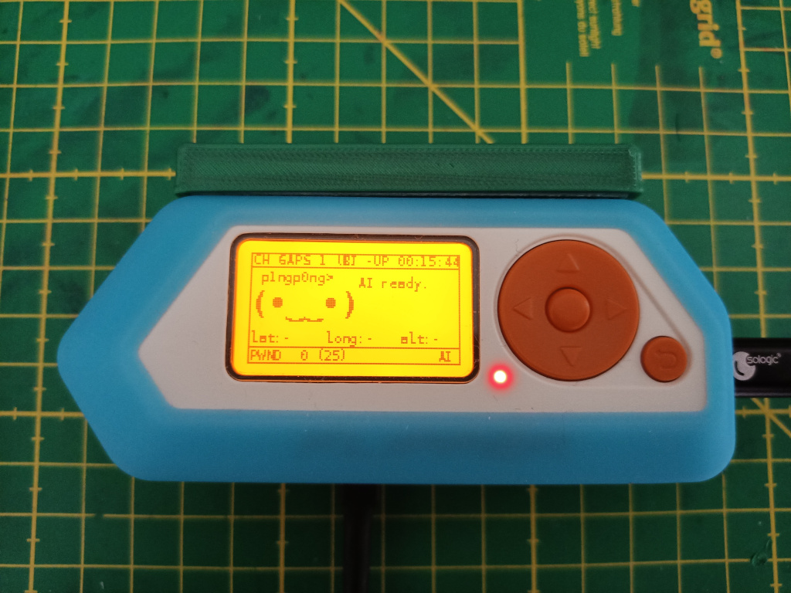

# Connect the Pwnagotchi to the Flipper Zero - work in progress!

The Raspberry Pi running the Pwnagotchi is connected over UART to the Flipper Zero.

Currently my Pwnagotchi plugin uses the "Esp32 Camera" app on the flipper to show the Pwnagotchi screen. I will develop a separate app in the future! 
You need to adjust the Ui on the Pwnagotchi - i have done this with a "dummydisplay" https://github.com/jayofelony/pwnagotchi-bookworm/pull/56/commits/418dbf21e330242416fa49d6c6792393eb5566c8 
You can find my dummydisplay.py in the folder pwnagotchi

To do:
- clean up the plugin code
- write instructions
- interact with the Pwnagotchi
- write a Flipper application
